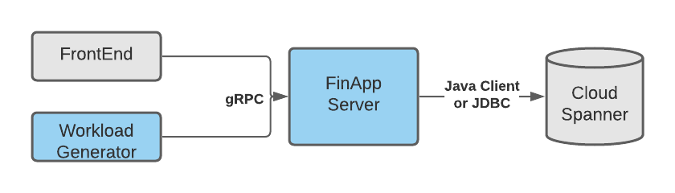
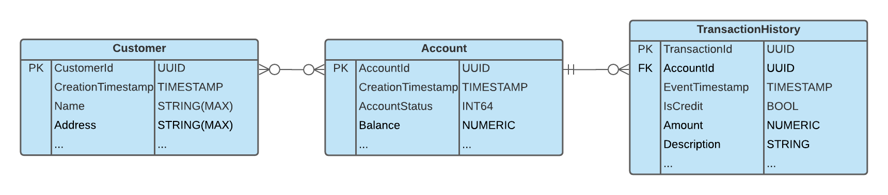

# Cloud Spanner Banking Application

This repository provides the source code for a Cloud Spanner sample financial
application. It consists of 2 components:
1. A gRPC server that provides application level functionality
  (see: [service.proto](server/src/main/proto/service.proto)) using CloudSpanner
  as the storage backend, found in the [server](server) directory
2. A workload generator for the above, found in the [workload](workload) directory

The goal of the sample is to provide a simple working example to jump-start
exploring Cloud Spanner.

## Architecture & Schema

### Application Components
This is how everything fits together:


The FinAppServer is the backend of the application. It provides a gRPC interface
with application-level operations and uses Cloud Spanner as the storage backend.
We provide two alternative implementations for connecting to Cloud Spanner for
educational purposes:
- [Cloud Spanner Java Client](https://github.com/googleapis/java-spanner)
- [Cloud Spanner JDBC](https://github.com/googleapis/java-spanner-jdbc)

Clients, including the workload generator, a potential frontend component, or
tools like [grpc_cli](https://github.com/grpc/grpc/blob/master/doc/command_line_tool.md)
can connect to the FinAppServer using gRPC.

### ER Diagram & Operations

The application models the following entities:
- *Customer*: End-user of the application. A customer can have one or more
  accounts.
- *Account*: A financial account, keeps track of balance. Multiple customers
  could access a single account with different roles.
- *Transaction*: A monetary transfers associated with the accounts

Captured as an ER diagram:


The backend should support the following operations:
- *CreateCustomer*
- *CreateAccount*
- *CreateCustomerRole*: Associate a customer with a role for a specified
  account
- *CreateTransactionForAccount*: Monetary transfer between an account and an
  external entity
- *MoveAccountBalance*: Monetary transfer between two accounts
- *GetRecentTransactionsForAccount*: Returns recent transactions for an account,
  should support pagination.

### Schema design
Good schema design can unlock Cloud Spanner capabilities for scale-out with
essentially no limits by automatically sharding data based on load and size.
On the other hand, schema anti-patterns, like
[hotspotting](https://cloud.google.com/spanner/docs/schema-design#primary-key-prevent-hotspots),
can cause bottlenecks and seriously handicap performance. Developers using
Cloud Spanner should familiarize themselves early with Cloud Spanner's
[data model](https://cloud.google.com/spanner/docs/schema-and-data-model) and
[schema best practices](https://cloud.google.com/spanner/docs/schema-design).
This section gives examples of how schema best practices apply to the finance
application, for the full schema see
[schema.sdl](server/src/main/java/com/google/finapp/schema.sdl).

#### Primary Keys and UUIDs
Using a column whose value monotonically increases, or decreases, as the first
key of a high write rate table or index should be avoided as it can cause
[hot-spots](https://cloud.google.com/spanner/docs/schema-design#primary-key-prevent-hotspots).
For this reason the sample uses [UUIDs](https://cloud.google.com/spanner/docs/schema-design#uuid_primary_key)
for all primary keys (e.g: CustomerId, AccountId).
 
#### Foreign keys and Interleaving
Interleaving is a good choice for many parent-child (1-to-N) relationships.
It allows co-location of child rows with their parent rows and can
significantly improve performance, for details see:
[interleaved tables](https://cloud.google.com/spanner/docs/schema-and-data-model#creating-interleaved-tables)
[comparison with foreign keys](https://cloud.google.com/spanner/docs/foreign-keys/overview#fk-and-table-interleaving).

The *Account* to *TransactionHistory* relation is a good example for using
interleaving. It is a 1-to-N relationship. Moreover, all financial transfers
would need to update both tables (add a row to *TransactionHistory* and update
the *Account* *balance* for the same AccountId). Interleaving
*TransactionHistory* under *Account* results co-locating relevant rows and as a
result allows such updates to be performant.

The *Customer* to *Account* relation, is an M-to-N and requires a separate
table: *CustomerRole*. *CustomerRole* could use foreign keys for both
*CustomerId* and *AccountId*, or be interleaved in one of *Customer*, *Account*
and use foreign key for the other. We decided to interleave under *Customer*
assuming that future operations might take advantage of co-location,
but any solution would work equally well for the target operations.

#### Timestamp Ordering

Tables (or indexes) that have some type of history keyed by timestamp are
common, *TransactionHistory* is a good example. In such cases it is important
to:
1. Do not use the timestamp as the first key part (see [hot-spotting](https://cloud.google.com/spanner/docs/schema-design#primary-key-prevent-hotspots))
2. Use [descending order for timestamps](https://cloud.google.com/spanner/docs/schema-design#ordering_timestamp-based_keys)

Indeed, for *TransactionHistory* we use primary key:
`AccountId, EventTimestamp DESC` which is optimal for the
`GetRecentTransactionsForAccount` operation. Note that all operations described
create at most one new row in *TransactionHistory*, in such cases it is safe
to use the commit timestamp as a key.

## Running the application
<!---TODO: Running against real spanner - Probably point to neos tutorial-->
### Running against Cloud Spanner emulator

NOTE: Requires bash, gcloud, mvn, grpc_cli installed.

1. Create a database locally using cloud-spanner-emulator and export spanner host
for client libraries to work.

    ```
    $ mvn clean install -Dmaven.test.skip=true
    $ bash run.sh emulator
    $ export SPANNER_EMULATOR_HOST="localhost:9010"
    ```

2. Bring up the FinAppServer hosting a grpc service.

    ```
    $ bash run.sh server java \
        --spanner_project_id=test-project --spanner_instance_id=test-instance \
        --spanner_database_id=test-database
    ```
> To run the application using the JDBC implementation, in the command above,
substitute `java` with `jdbc`.

3. Call RPCs using grpc_cli.

    ```
    $ grpc_cli call localhost:8080 CreateCustomer \
        "name: 'google' address: 'amphitheatre pkwy'" --channel_creds_type=insecure
    ```

## How to run the workload generator

1. Bring up the finapp server using steps described above.

2. In a separate terminal, bring up the workload using the following command:
 
    ```
    $ bash run.sh workload \
        --address-name localhost --port 8080 --num-accounts 200 
    ```

## How to run the application tests

1. Set up the emulator as described in #1 above.
2. `mvn integration-test` tests the Java client implementation
3. `mvn integration-test -DSPANNER_USE_JDBC=true` tests the JDBC implementation
