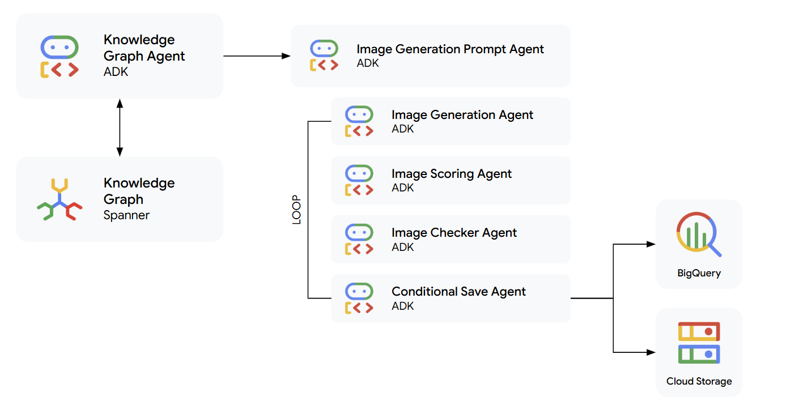

# Comical agent

These two applications demonstrate the use of the [ADK](https://cloud.google.com/vertex-ai/generative-ai/docs/agent-engine/develop/adk?utm_campaign=CDR_0x6cb6c9c7_default_b447004393&utm_medium=external&utm_source=social), Spanner graph capabilities, [Spanner for LangChain](https://cloud.google.com/python/docs/reference/langchain-google-spanner/latest?utm_campaign=CDR_0x6cb6c9c7_default_b447004393&utm_medium=external&utm_source=social) and [Nano Banana Image Generation](https://gemini.google/overview/image-generation/) to build an agent that takes a question and responds with a comic strip.

## Setup

1. [Load the Knowledge Graph](knowledge-graph-loader/README.md):Use the data loader to create a knowledge graph with embeddings.
2. [Create an agentic application](adk-comic-generator/spanner-comics/README.md): Use the Agent Development Kit to coordinate agents that tap into your Spanner knowledge graph and use Nano Banana image generation to create comic strips.

See the README files for each application for further instructions.
