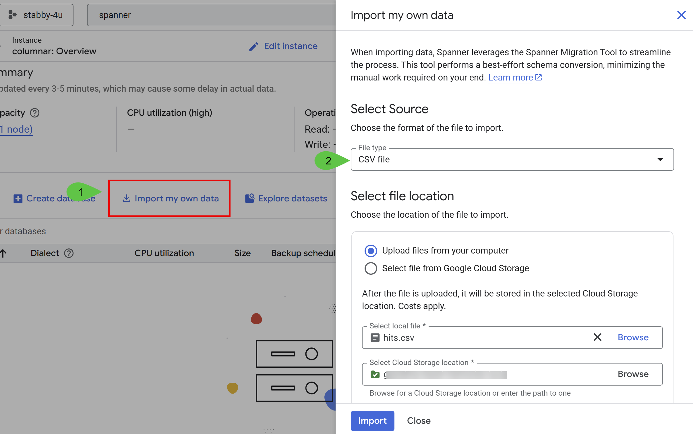

#  Schema and queries for Columnar Engine Benchmark.

These queries will allows you to compare the performance of certain queries when using [Spanner columnar engine](https://docs.cloud.google.com/spanner/docs/columnar-engine?utm_campaign=CDR_0x6cb6c9c7_default&utm_medium=external&utm_source=blog)

## Prerequisites
- Provision a [new Spanner instance](https://console.cloud.google.com/spanner/instances/new?utm_campaign=CDR_0x6cb6c9c7_default&utm_medium=external&utm_source=blog) or use an existing one. The minimum edition should be [Enterprise Edition](https://docs.cloud.google.com/spanner/docs/editions-overviewhttps://docs.cloud.google.com/spanner/docs/columnar-engine?utm_campaign=CDR_0x6cb6c9c7_default&utm_medium=external&utm_source=blog).  
- Download the CSV version of [this dataset](https://github.com/ClickHouse/ClickBench?tab=readme-ov-file#data-loading)
- Download the [table schema](https://github.com/GoogleCloudPlatform/cloud-spanner-samples/blob/main/columnar-engine/benchmark-schema.sql)
- A Google Cloud Storage bucket to upload the CSV file and the schema

## Run the queries

You can directly upload the CSV file to your Spanner instance through the **Import my own data**.

1.   Extract and upload the CSV file into a GCS bucket 
2.   Upload the schema into the GCS bucket
3.   Follow the instructions from the **Import my own data** wizard

4.   Copy and paste the queries into Spanner Studio

