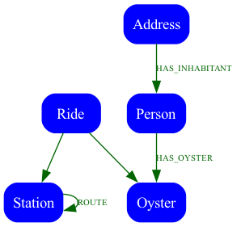

# Let's Catch Some Transit Fraudsters

This is a demo on how to catch some people trying to commit transit fraud

The London Underground network has been loaded as a graph into Spanner Graph with the following relationships



Oyster Transit Cards are linked to people, who have addresses and the rides are stored in the database.
It is possible to find fraud for a card that has swiped at a location that it could not possibly reach given the minimum transit time.

Once an entry point to a fraud investigation it is possible to link that card to other fradulent cards and discovery interesting relationships.

## Setup Gcloud 

```bash
gcloud auth application-default login
make instancecreate
make loadschema
```


## Get Python setup and load the Data

```bash
python3 -m venv .venv
source .venv/bin/activate
pip install -r requirements.txt
./load_data.py
```

## Run the Webapp

```bash
./app.py
```

## Start Queryring

[Queries](./SampleQueries.md)

## Running Raw Queries

You can also run a raw query to receive back a JSON object detailing the paths

```bash
curl -s -X POST  -d '(Station{id: 155})-[r:ROUTE]->{1,4}(t:Station)' http://localhost:5000/raw |jq
```
