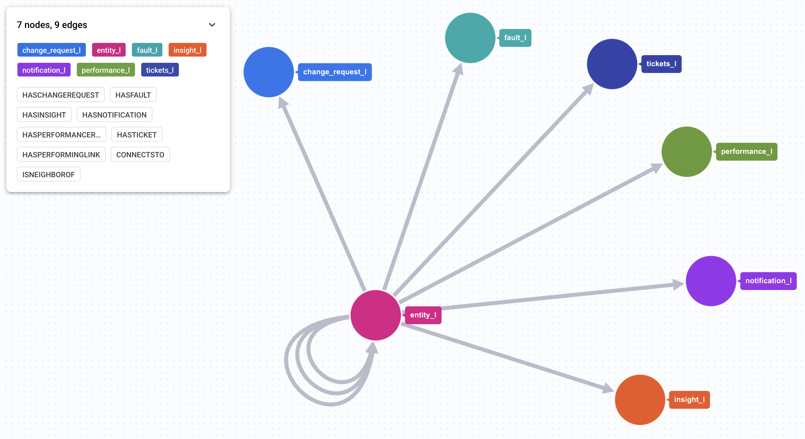

## Network Digital Twin on Spanner Graph for Telcos and CSPs
 
A Network Digital Twin is the heart of the [Autonomous Network Operations framework](https://cloud.google.com/blog/topics/telecommunications/the-autonomous-network-operations-framework-for-csps?e=48754805). It is not merely a static inventory or topology map, but a dynamic, multi-layer, real-time representation of the network.

This notebook demonstrates how to leverage Spanner Graph to model, visualize, and query a complex telecommunications network. We will:
* Load realistic network data(generated with help of Gemini) into Spanner tables.
* Define a graph on top of this data
* Run a series of queries to uncover insights about the network's topology and health.

The data used for populating the Spanner Tables is provided as a tar.gz : `network-digital-twin/data/telco-notebook-data.tar.gz`. The notebook can be found here: `network-digital-twin/Network_Digital_Twin_Spanner_Graph_Notebook.ipynb`

You can upload and run this notebook on Google Colab or use Vertex AI Notebooks.

